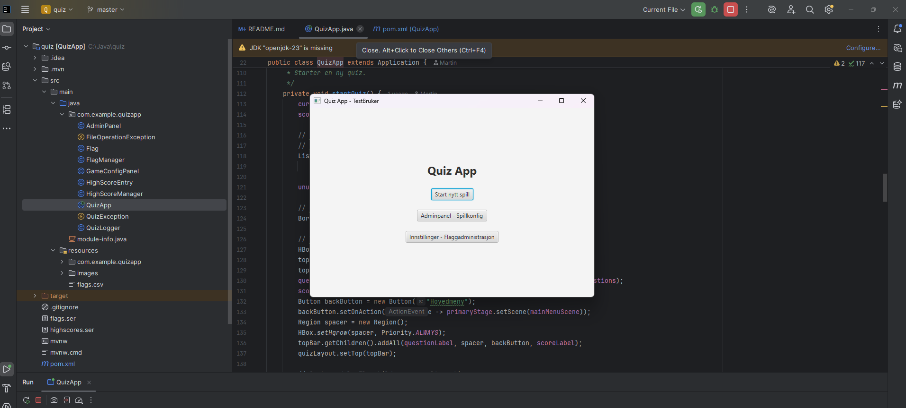
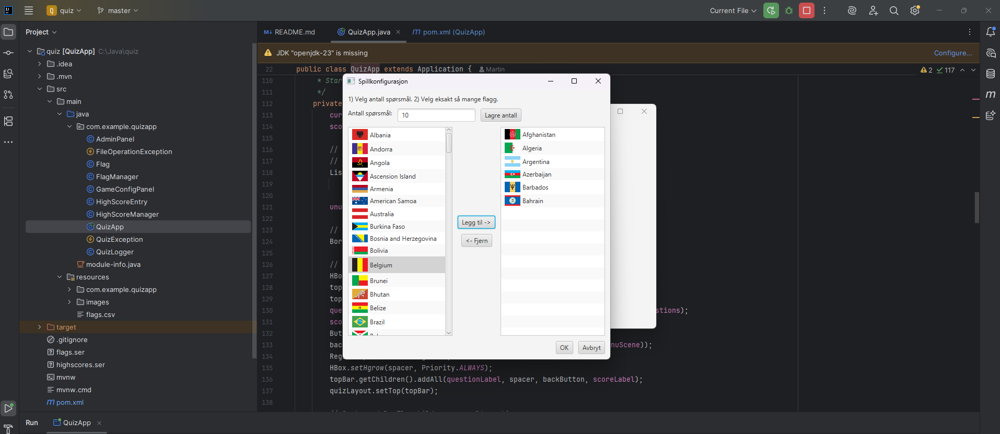
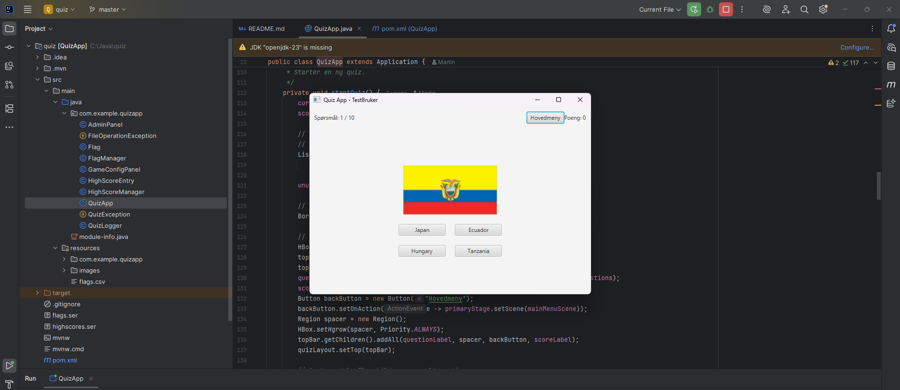

# JavaFX Flag Quiz

Et interaktivt og dynamisk flagg-quiz-spill bygget i ren Java med JavaFX. Dette prosjektet ble utviklet som en obligatorisk oppgave og demonstrerer god objektorientert design, filhåndtering og et rent grafisk brukergrensesnitt.

---

## Visuell Oversikt

Her er noen glimt av applikasjonens hovedfunksjoner, fra den enkle hovedmenyen til det mer avanserte konfigurasjonspanelet.

| Hovedmeny | Quiz i Aksjon | Spillkonfigurasjon |
| :---------------------------------: | :---------------------------------: | :---------------------------: |
|  |  |  |
| *En ren og enkel startmeny.* | *Et interaktivt quiz-grensesnitt.* | *Adminpanel for å skreddersy quizen.* |

---

## Om Prosjektet

Dette er en fullverdig desktop-applikasjon som lar brukere teste sin kunnskap om verdens flagg. Appen er delt inn i to hoveddeler: en spillmodus for brukere og et adminpanel for å administrere innholdet i quizen.

### Hovedfunksjoner

*   ✅ **Interaktiv Quiz:** En flervalgsquiz med dynamisk genererte spørsmål og svaralternativer.
*   ✅ **Visuelle Animasjoner:** Appen bruker enkle animasjoner for å gi umiddelbar tilbakemelding på riktige og gale svar.
*   ✅ **High Score-liste:** Lagrer og viser de fem beste resultatene lokalt.
*   ✅ **Robust Adminpanel:**
    *   Full CRUD-funksjonalitet (Create, Read, Update, Delete) for flagg og land.
    *   Visuell filvelger for å koble land til riktig bilde.
    *   Mulighet for å konfigurere antall spørsmål og hvilke flagg som skal inkluderes i en runde.
*   ✅ **Persistent Lagring:** All data (flagg, high scores, spillhistorikk) lagres lokalt ved hjelp av Java-serialisering og enkle tekstfiler.

### Teknologistack & Konsepter

*   **Språk:** Java
*   **GUI Rammeverk:** JavaFX
*   **Byggesystem:** Apache Maven
*   **Kjernekonsepter:** Objektorientert programmering (OOP), fil-I/O (serialisering, CSV-parsing), event-drevet programmering.

---

## Komme i Gang

### Forutsetninger
*   Java JDK 17 eller nyere
*   Apache Maven

### Kjøre Applikasjonen

1.  **Klon repositoriet:**
    ```bash
    git clone https://github.com/martingit2/quiz.git
    cd quiz
    ```

2.  **Kompiler og kjør med Maven:**
    Den enkleste måten å kjøre appen på er med JavaFX Maven-pluginen, som håndterer alle moduler for deg.
    ```bash
    mvn clean javafx:run
    ```

---
## Refleksjon rundt oppgaven
Dette prosjektet ble utviklet som en del av den obligatoriske oppgaven 1 i OBJ2100. En separat `FlagDownloader`-app ble også utviklet for å effektivisere innsamlingen av bildemateriell.

**Forfatter:** Martin Pettersen